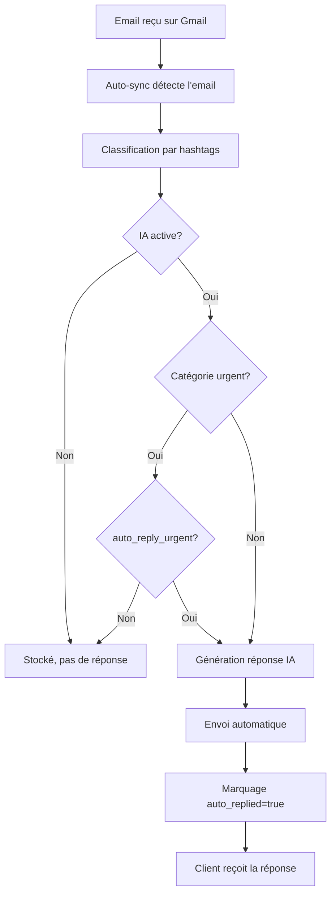

# Système IA Active - Réponses Automatiques

## 📋 Vue d'ensemble

Le système d'IA active permet d'envoyer **automatiquement** des réponses aux emails entrants, sauf pour les emails urgents.

## 🎯 Fonctionnement

### 1. Activation/Désactivation

**Par défaut, l'IA est INACTIVE** pour éviter les envois accidentels.

- **Toggle dans Mail Center** : Bouton "IA Active/Inactive" dans la sidebar
- **État sauvegardé** : Dans la table `ai_settings` de Supabase
- **API** : `/api/mail-center/ai-settings` (GET/POST)

### 2. Flux Automatique

```
Email reçu → Synchronisation → Classification → IA génère réponse → Envoi automatique
```

**Détails du flux** :

1. **Email arrive** sur Gmail/Outlook
2. **Auto-sync** (`/api/mail-center/auto-sync`) récupère l'email
3. **Classification** automatique par hashtags (`classifyEmailByHashtags()`)
4. **Vérification IA active** : Si `enabled = true` dans `ai_settings`
5. **Génération réponse** : `generateReplyWithAI()` crée une réponse contextuelle
6. **Envoi automatique** : Via `/api/mail-center/send-reply`
7. **Marquage** : Email marqué avec `auto_replied = true`

### 3. Règles d'exclusion

❌ **PAS de réponse automatique si** :
- IA est inactive (`enabled = false`)
- Email classé "urgent" (sauf si `auto_reply_urgent = true`)
- Email déjà traité (`auto_replied = true`)

✅ **Réponse automatique si** :
- IA active
- Catégorie : commande, remboursement, question-produit, suivi-commande, SAV, réclamation, information, facturation, technique, autre
- Premier email non traité

## 🗄️ Tables Supabase

### `ai_settings`
```sql
CREATE TABLE ai_settings (
  id UUID PRIMARY KEY,
  user_email TEXT UNIQUE NOT NULL,
  enabled BOOLEAN DEFAULT FALSE,        -- IA active/inactive
  auto_reply_urgent BOOLEAN DEFAULT FALSE,  -- Répondre aux urgents aussi
  created_at TIMESTAMPTZ,
  updated_at TIMESTAMPTZ
);
```

### `emails_cache` (nouvelles colonnes)
```sql
ALTER TABLE emails_cache
ADD COLUMN auto_replied BOOLEAN DEFAULT FALSE;

ADD COLUMN auto_replied_at TIMESTAMPTZ;

ADD COLUMN support_category TEXT CHECK (...);

ADD COLUMN detected_hashtags TEXT[];
```

## 🔌 APIs Créées

### 1. `/api/mail-center/ai-settings`

**GET** - Récupérer l'état de l'IA
```json
{
  "enabled": false,
  "auto_reply_urgent": false,
  "updated_at": "2025-01-08T..."
}
```

**POST** - Activer/désactiver l'IA
```json
{
  "enabled": true,
  "auto_reply_urgent": false
}
```

### 2. `/api/mail-center/auto-reply`

**POST** - Traiter les emails non répondus (appelé automatiquement après sync)

Retourne :
```json
{
  "message": "3 réponse(s) automatique(s) envoyée(s)",
  "processed": 3,
  "errors": []
}
```

## 🎨 Interface Utilisateur

### Toggle IA Active/Inactive

**Localisation** : Mail Center → Sidebar gauche → "Configuration Support"

**Apparence** :
- 🟢 **IA Active** : Bouton vert avec icône ⚡
- ⚪ **IA Inactive** : Bouton gris avec icône ⚡

**Fonctionnement** :
```typescript
const toggleAI = async () => {
  const newState = !isAIActive;
  await fetch('/api/mail-center/ai-settings', {
    method: 'POST',
    body: JSON.stringify({ enabled: newState })
  });
  setIsAIActive(newState);
};
```

## ⚙️ Configuration IA par Catégorie

Les réponses sont personnalisées selon :
- **Catégorie détectée** : urgent, commande, SAV, etc.
- **Ton** : professionnel, amical, formel
- **Template** : Défini dans `ai-prompt-config.ts`

Exemple pour "SAV" :
```typescript
'sav': `Le client a un problème avec un produit acheté.
Faites preuve d'empathie, proposez un diagnostic, 
et les solutions (réparation, échange, remboursement).`
```

## 🧪 Testing

### 1. Appliquer les migrations SQL

**Dans Supabase Dashboard** → SQL Editor :

```sql
-- Migration 1: Support category
\i supabase/migrations/20250108_add_support_category.sql

-- Migration 2: AI settings
\i supabase/migrations/20250108_add_ai_settings.sql
```

### 2. Activer l'IA

1. Aller sur http://localhost:3000/mail-center
2. Cliquer sur le bouton "IA Inactive" → devient "IA Active" (vert)

### 3. Envoyer un email de test

Envoyer un email à votre compte connecté avec :
- **Sujet** : "Question sur ma commande #12345"
- **Corps** : "Bonjour, où est ma commande ?"

### 4. Synchroniser

Cliquer sur "Synchroniser" dans Mail Center

### 5. Vérifier la réponse automatique

- Email classé en "commande" (hashtag détecté)
- IA génère une réponse professionnelle
- Réponse envoyée automatiquement
- Email marqué `auto_replied = true`

## 🚨 Important

### Sécurité
- ⚠️ **IA INACTIVE par défaut** pour éviter les envois accidentels
- ✅ Emails urgents jamais répondus automatiquement (sauf activation explicite)
- ✅ RLS (Row Level Security) sur toutes les tables

### Limites
- **Max 10 emails** traités par appel à `/auto-reply`
- **Timeout 60s** sur auto-sync
- **Quota OpenAI** : Vérifier les limites de votre clé API

### Monitoring
- Logs dans console : `[AUTO-SYNC]`, `[AUTO-REPLY]`
- Table `emails_cache` : Colonne `auto_replied_at` pour tracking
- Statistiques : Nombre de réponses auto dans analytics

## 🔄 Workflow Complet



## 📝 Variables d'environnement requises

```bash
# OpenAI
OPENAI_API_KEY=sk-...

# Supabase
NEXT_PUBLIC_SUPABASE_URL=https://...
SUPABASE_SERVICE_ROLE_KEY=...

# App URL (pour appels API internes)
NEXT_PUBLIC_APP_URL=http://localhost:3000
```

## 🎓 Prochaines étapes

1. ✅ Appliquer les migrations SQL dans Supabase
2. ✅ Tester avec un email réel
3. 🔜 Configurer les prompts par catégorie dans "Configuration IA"
4. 🔜 Ajouter des produits dans "Base de Connaissances"
5. 🔜 Monitorer les quotas OpenAI
6. 🔜 Créer un dashboard analytics pour les réponses auto

## 🐛 Dépannage

**L'IA ne répond pas automatiquement** :
- Vérifier que le toggle est sur "IA Active" (vert)
- Vérifier que l'email n'est pas "urgent"
- Vérifier les logs console pour les erreurs
- Vérifier que OPENAI_API_KEY est configurée

**Réponses de mauvaise qualité** :
- Aller dans "Configuration IA"
- Personnaliser les prompts par catégorie
- Ajouter du contexte dans "Base de Connaissances"

**Erreur d'envoi** :
- Vérifier les tokens Gmail/Outlook valides
- Vérifier les permissions de l'API
- Vérifier les quotas d'envoi
